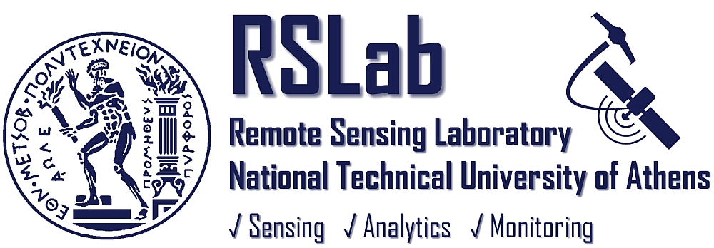
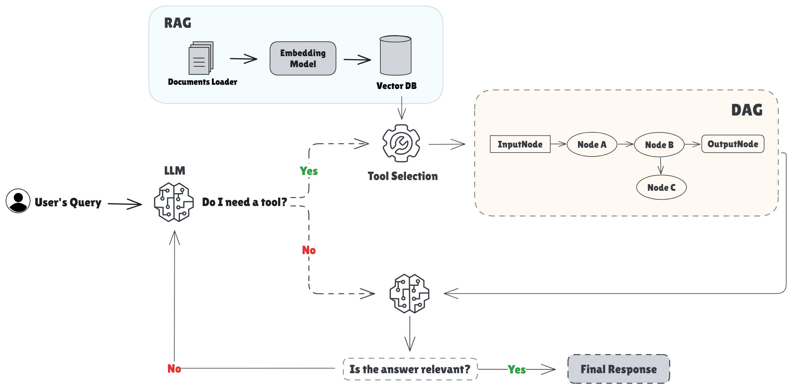

# NAIAD

 📄 **Source code** accompanying the paper [NAIAD: Novel Agentic Intelligent Autonomous System for Inland Water Monitoring]()

 🖋️ **Authors**: Eirini Baltzi, Tilemachos Moumouris, Athina Psalta, Vasileios Tsironis, Konstantinos Karantzalos

 🏛️ **Remote Sensing Lab**, National Technical University of Athens, Greece

<p align="center">
  
</p>

📢 To be presented at ***SPIE Sensors + Imaging 2025***,  
Remote Sensing for Agriculture, Ecosystems, and Hydrology XXVII


## Paper Summary
**NAIAD** is a novel agentic system that combines Retrieval-Augmented Generation (RAG), tool orchestration, and dynamic Directed Acyclic Graph (DAG) construction to support inland water monitoring across multiple Greek lakes. It uses an LLM to dynamically construct reasoning workflows, execute toolchains, and generate data-driven reports.

<div align="center">
  
</div>

<br>

>**_Figure 1: Overview of the NAIAD system architecture and workflow._** After the user submits a query, NAIAD interprets this query using RAG to retrieve relevant domain knowledge and add context. The LLM then determines whether external tools are needed, selecting and orchestrating them by dynamically constructing a Directed Acyclic Graph (DAG) that encodes the analytical workflow. Throughout the process, reflection mechanisms ensure output relevance and accuracy. The final report synthesizes all findings and is tailored to the user’s expertise.

This repository contains a modular version of the NAIAD system, showcasing its core logic, prompting techniques, and agentic execution architecture.

---

## 🚀 Features

- **DAG-based Tool Orchestration**  
  Dynamically generated execution graphs, customized to each query

- **Retrieval-Augmented Generation (RAG)**  
  Contextualizes outputs with lake-specific and climate documents

- **LLM-driven Interpretation & Reasoning**  
  Uses models like `qwen2.5:14b` via [Ollama](https://ollama.com/) or compatible endpoints

- **Integrated Tools**  
  - NDCI fetching  
  - Chlorophyll estimation  
  - Cyanobacteria prediction (CyFi)  
  - Weather data retrieval  
  - Report generation

---

## 📁 Directory Structure

```bash
naiad-agentic-rag/
├── core/                   # Core orchestration and agent logic
│   ├── agent_controller.py
│   ├── tools.py
│   ├── agent_scaffold.py
│   ├── main_agent.py
│   └── __init__.py
│
├── system_prompts/         # Modular prompts used by the agent
├── rag_docs/               # Sample RAG documents (lakes) 
├── main.py                 # CLI entry point
├── requirements.txt        # Dependencies
└── README.md               # You're here
